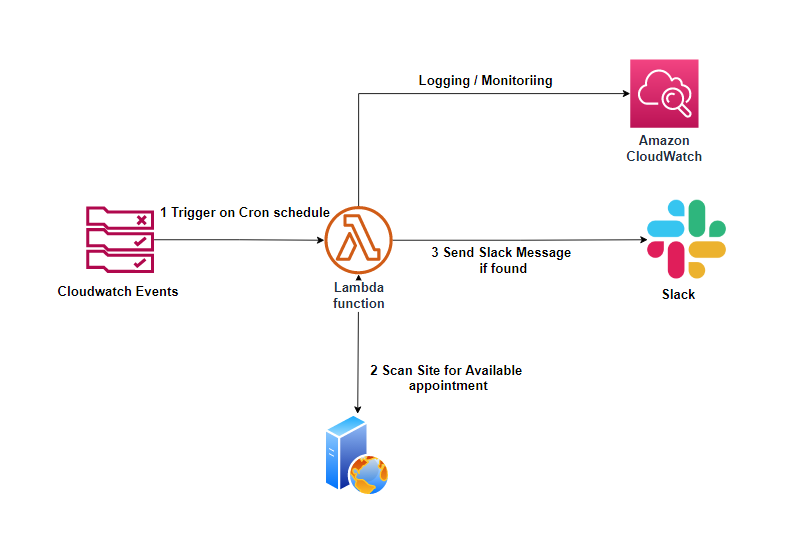
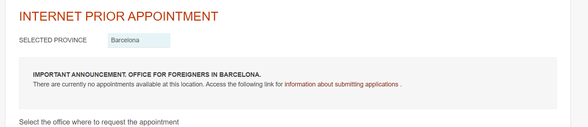

# Nie Appointment Finder
This tool checks for available NIE Appointment(s) in the Barcelona office and sends a Slack message if found

---

## Architecture

Suggested deployment architecture

### Why?

At the time of development it is extremely difficult to find a NIE Appointment in Barcelona. 

---

### :flags: Environment Variables
Environment Variables used in script

| Variable | Description |
| -------- | ----- |
| `SLACK_WEBHOOK_URL` | Incoming Webhook URL for Slack |
| `SLACK_MEMBER_ID` | Member ID of User to Mention | 

### Todo

:white_check_mark: Add Slack notifications  
:white_square_button: Add Terraform deployment scripts  
:white_square_button: Save polling results to database  
:white_square_button: Dashboard historical availability using db